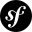
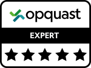

## Bonjour!  👋

<!--
**carmen-blanaru/carmen-blanaru** is a ✨ _special_ ✨ repository because its `README.md` (this file) appears on your GitHub profile.

Here are some ideas to get you started:

- 🔭 I’m currently working on ...
- 🌱 I’m currently learning ...
- 👯 I’m looking to collaborate on ...
- 🤔 I’m looking for help with ...
- 💬 Ask me about ...
- 📫 How to reach me: ...
- 😄 Pronouns: ...
- ⚡ Fun fact: ...
-->
### Qui suis-je? 

Je m'appelle **Carmen** et j'habite en région parisienne. Après 5 ans passés dans la formation pour adultes (j'ai été formatrice de français langue étrangère), j'ai souhaité faire une reconversion professionnelle dans le domaine du numérique. Passionnée par l'informatique mais n'osant pas trop m'aventurer dans cette univers, j'ai suivi des ateliers d'initiation afin de percer ses mystères. La découverte du métier de la programmation a été une véritable révélation. J'ai continué à approfondir ce domaine en autonomie jusqu'à ce que je décide de suivre une formation pour devenir développeuse web. 

J'ai intégré l'école O'clock où j'ai suivi une formation intensive et à distance de 5 mois dans le développement. Le socle commun de 3 mois m'a permis d'acquérir des compétences générales en **html5**, **css3**, **JS** et **php**. Ensuite j'ai enchaîné avec un mois de spécialisation dans le **framework Symfony** suivi d'un mois de projet en conditions réelles, appelé *le mois d'apothéose*. 

### Qu'est-ce que je sais faire? 

  Hardskills    |   Softskills
  -----------   |   -------------
  | Force de proposition 
  | Rigueur 
  | Curiosité
  | Capacité d'adaptation 
  | Persévérance 
  | Réactivité  
  | Sens de l'organisation 
  | Gestion du stress
  | Capacité de décision 
  | Travail en équipe

 ### Vous pouvez me retrouver sur les réseaux sociaux 

 * [LinkedIn](https://www.linkedin.com/in/carmen-blanaru-a7b79a1a0/)
 * [Twitter](https://twitter.com/carmen_blanaru?t=LgRNsR3up5JSK9tta39ztw&s=03)
 * [Facebook](https://www.facebook.com/monica.blanaru.3)

### Projets déjà développés 

Lors du mois d'apothéose, nous avons du réaliser un projet en équipe. Utilisant la méthode SCRUM, elle-même basée sur les principe de la méthode Agile, nous avons développé pendant un mois le projet `NALA` (nos amis les animaux). C'est un nouveau concept de réseau social dans le même style qu'Instagram mais basé sur le partage des photos des animaux (animaux de compagnie ou sauvages). L'accès au site est libre, les visiteurs ont la possibilité de se créer un compte, de s'y connecter et ainsi de pouvoir partager des photos, aimer et/ou commenter les photos des autres utilisateurs. Le site a été réalisé en React (pour le front) et Symfony (pour le back), le lien entre les deux parties se fait grâce à une API créée par moi et mon collègue back. 

* [NALA](https://nos-amis-les-animaux.fr/)
* [NALA-backoffice](https://back.nos-amis-les-animaux.fr/admin)

### Projets en cours de développement 

Actuellement, je suis en train de développer un petit projet personnel en php et symfony sur un coffee shop imaginaire. Grande amateure de café, je souhaite mettre en place un site vitrine destiné aux amoureux de café. Le site contiendra des informations sur l'établissement, ses horaires d'ouverture, les origines de son café ainsi que les assortiments de café proposés.  

* php/symfony - CoffeeTime 
  

### Me connaitre davantage 

Début septembre j'ai passé la certification en qualité web OPQUAST. J'ai obtenu 900 points / 1000 et j'ai un joli badge expert 

Je parle 3 langues :  
 `français` -> bilingue  
`anglais` -> courant  
 `roumain` -> langue maternelle  

   

